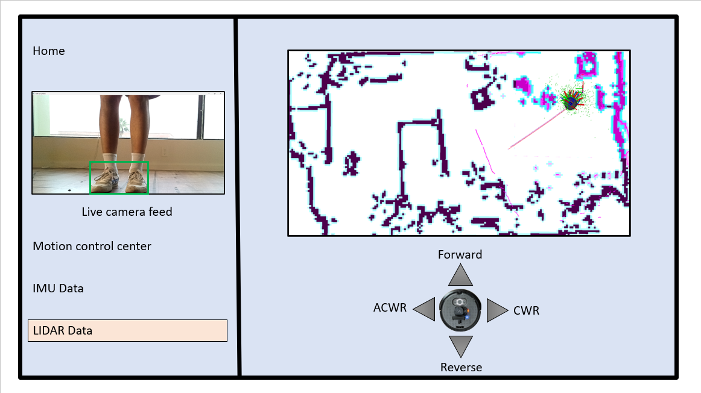
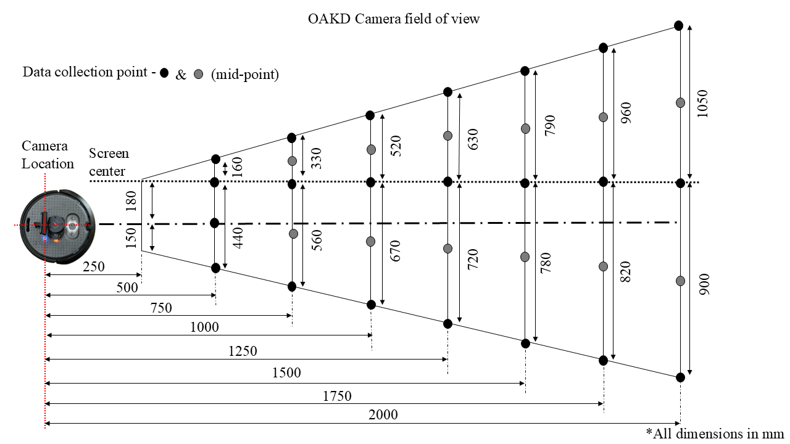
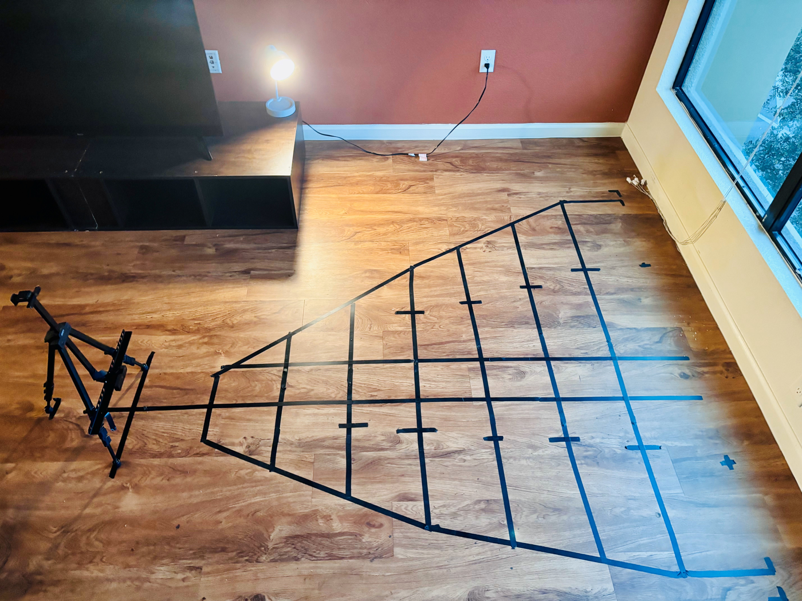
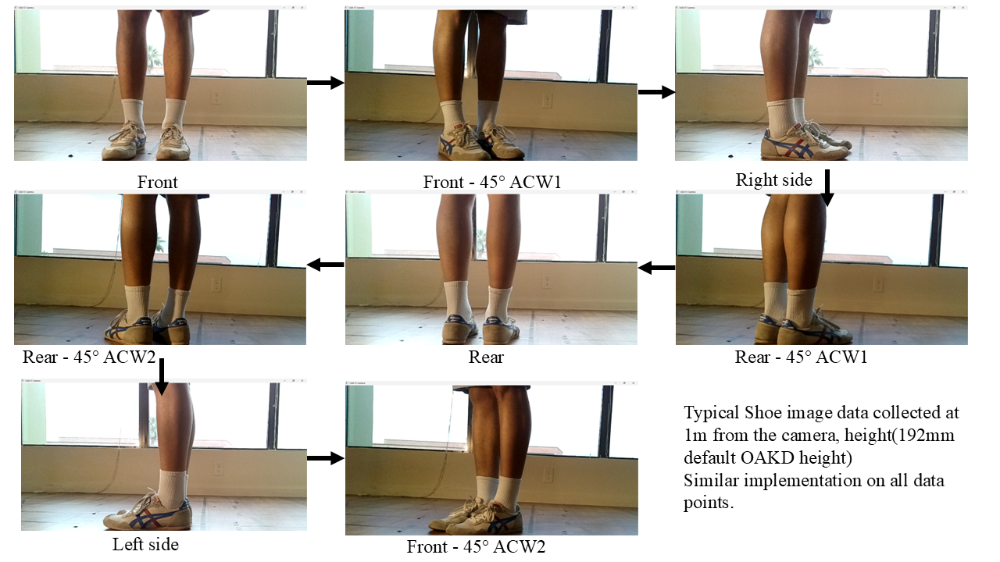
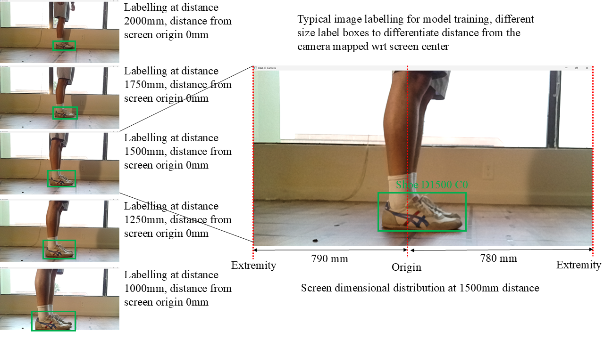
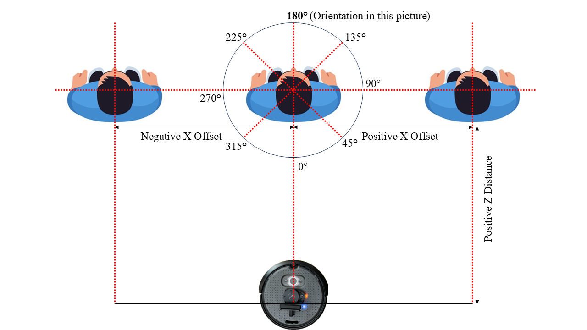
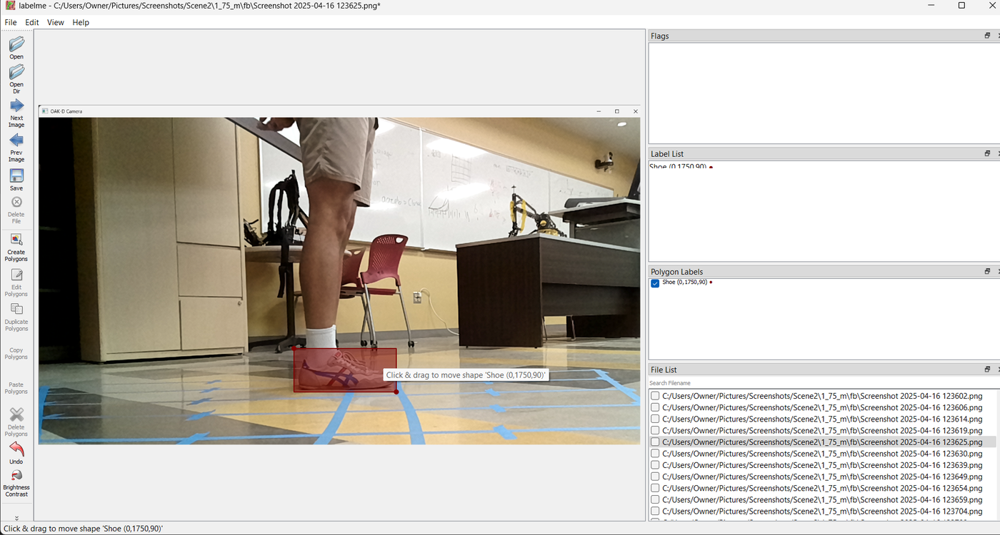
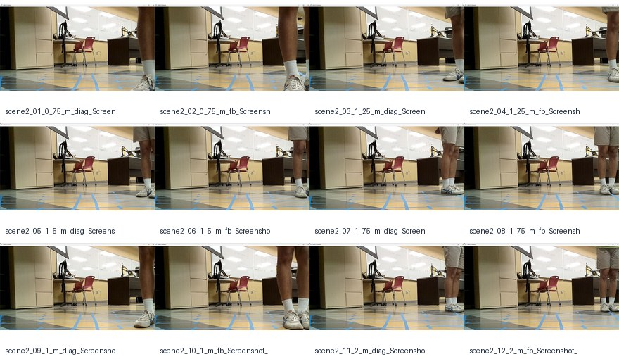

<div align="center">

# Assistive Follower Robot

### ROS 2 follower robot using OAK-D shoe localization, PyTorch vision, and LiDAR gap navigation

Robotics · ROS 2 · TurtleBot4 · OAK-D · LiDAR · PyTorch · Computer Vision · Assistive Robotics

</div>

---

<p align="center">
  
</p>

## Overview

This repository is the polished portfolio version of an assistive follower robot project. The system combines:

- **OAK-D camera perception** to localize a user cue/shoe in the camera frame
- **PyTorch ResNet18-style regression** to estimate target pose from images
- **LiDAR follow-the-gap navigation** for reactive obstacle avoidance
- **ROS 2 nodes** that connect perception, heading estimation, and velocity control

> Hardware-dependent prototype: the navigation node can be tested with simulated heading input, but the full stack requires a TurtleBot-style robot, LiDAR scan topic, OAK-D camera image topic, and trained model weights.

---

## System at a Glance

<table>
<tr>
<td width="50%" align="center"><b>Physical / hardware layout</b></td>
<td width="50%" align="center"><b>ROS 2 software architecture</b></td>
</tr>
<tr>
<td></td>
<td></td>
</tr>
</table>

The robot uses camera input to estimate the user heading, LiDAR to identify safe free-space gaps, and a control node to publish velocity commands.

---

## What This Project Demonstrates

| Area | Evidence in this repo |
|---|---|
| **ROS 2 integration** | Separate perception, simulated heading, and navigation nodes connected through explicit topics |
| **Robotics navigation** | LiDAR preprocessing, obstacle bubble masking, free-space gap selection, and velocity control |
| **Computer vision** | OAK-D image pipeline, shoe localization, and model-based heading estimation |
| **ML workflow** | LabelMe annotation, normalized labels, PyTorch training script, dataset card, and model card |
| **Hardware awareness** | TurtleBot/OAK-D/LiDAR assumptions, launch files, parameters, and safety notes |
| **Portfolio quality** | Clean docs, images, model notes, sample dataset, source references, and reproducible tooling |

---

## Perception and Dataset Pipeline

<table>
<tr>
<td width="50%" align="center"><b>OAK-D field-of-view mapping</b></td>
<td width="50%" align="center"><b>Data collection grid</b></td>
</tr>
<tr>
<td></td>
<td></td>
</tr>
</table>

<table>
<tr>
<td width="50%" align="center"><b>Pose diversity</b></td>
<td width="50%" align="center"><b>Distance variation</b></td>
</tr>
<tr>
<td></td>
<td></td>
</tr>
</table>

The vision pipeline predicts four regression outputs:

```text
[x_offset_norm, z_distance_norm, sin(theta), cos(theta)]
```

<table>
<tr>
<td width="50%" align="center"><b>Label convention</b></td>
<td width="50%" align="center"><b>LabelMe annotation workflow</b></td>
</tr>
<tr>
<td></td>
<td></td>
</tr>
</table>

<table>
<tr>
<td width="50%" align="center"><b>Live prediction output</b></td>
<td width="50%" align="center"><b>Sample frames</b></td>
</tr>
<tr>
<td></td>
<td></td>
</tr>
</table>

---

## Repository Structure

```text
assistive-follower-robot/
├── README.md
├── package.xml
├── setup.py
├── setup.cfg
├── requirements.txt
├── MODEL_CARD.md
├── DATASET_CARD.md
├── NOTICE.md
├── config/
│   └── params.yaml
├── launch/
│   └── follower.launch.py
├── assistive_follower_robot/
│   ├── gap_follower_node.py
│   ├── vision_angle_node.py
│   └── sim_heading_node.py
├── tools/
│   ├── import_labelme_annotations.py
│   ├── train_shoe_regressor.py
│   ├── live_oakd_predict.py
│   └── make_sample_contact_sheet.py
├── models/
│   └── shoe_model.pth  # download separately from Google Drive
├── data/
│   ├── shoe_dataset.csv
│   ├── sample_dataset.csv
│   ├── sample_images/
│   └── metadata/
├── images/
├── docs/
└── references/
```

---

## ROS 2 Topic Contract

<p align="center">
  
</p>

| Node | Purpose | Subscribes | Publishes |
|---|---|---|---|
| `gap_follower` | Reactive LiDAR gap navigation guided by target heading | `/rpi_11/scan`, `/rpi_11/person_heading_deg` | `/rpi_11/cmd_vel` |
| `vision_angle` | Camera/model-based heading prediction | `/color/preview/image` | `/rpi_11/person_heading_deg` |
| `sim_heading` | Fake heading publisher for testing without camera/model | none | `/rpi_11/person_heading_deg` |

This cleaned portfolio package uses `std_msgs/Float32` for the perception-navigation interface so the heading topic is simple and explicit.

---

## Quick Start

### 1. Clone into a ROS 2 workspace

```bash
mkdir -p ~/ros2_ws/src
cd ~/ros2_ws/src
git clone https://github.com/sksinghdeo/assistive-follower-robot.git
```

### 2. Install Python dependencies

```bash
cd ~/ros2_ws/src/assistive-follower-robot
pip install -r requirements.txt
```

### 3. Build the ROS 2 package

```bash
cd ~/ros2_ws
colcon build --packages-select assistive_follower_robot
source install/setup.bash
```

---

## Model Weights

The trained PyTorch model file is not committed directly to this repository because it exceeds GitHub browser upload limits.

Download the trained model here:

[Download shoe_model.pth](https://drive.google.com/file/d/1b0rS5kiqUQPc6da0CqnZwli_7nzqFTKU/view?usp=drive_link)

After downloading, place it at:

```text
models/shoe_model.pth
```

The ROS 2 vision node and standalone OAK-D inference script expect the model at this location.

---

## Run Modes

### Test mode — LiDAR + simulated heading

Use this when you have a scan topic but do not want to run the vision model yet.

```bash
ros2 launch assistive_follower_robot follower.launch.py use_sim_heading:=true use_vision:=false
```

### Full follower stack — LiDAR + OAK-D vision

Use this when the robot camera, LiDAR, and model file are available.

```bash
ros2 launch assistive_follower_robot follower.launch.py use_sim_heading:=false use_vision:=true
```

### Run nodes separately

```bash
ros2 run assistive_follower_robot gap_follower
ros2 run assistive_follower_robot vision_angle
ros2 run assistive_follower_robot sim_heading
```

---

## Train / Rebuild the Shoe Model

### Build CSV from LabelMe JSON annotations

```bash
python tools/import_labelme_annotations.py \
  --labelme-dir /path/to/Jason_files \
  --output-csv data/shoe_dataset.csv \
  --basename-only
```

### Train the model

```bash
python tools/train_shoe_regressor.py \
  --csv data/shoe_dataset.csv \
  --image-dir /path/to/full/scene2/images \
  --output-model models/shoe_model.pth \
  --epochs 100
```

### Run live OAK-D inference outside ROS 2

```bash
python tools/live_oakd_predict.py --model models/shoe_model.pth
```

---

## Documentation

- [System overview](docs/system_overview.md)
- [Hardware and interface](docs/hardware.md)
- [Data collection](docs/data_collection.md)
- [Vision model](docs/vision_model.md)
- [ROS 2 nodes](docs/ros2_nodes.md)
- [Testing and validation](docs/testing.md)
- [Portfolio scope](docs/portfolio_scope.md)
- [Visual index](docs/visual_index.md)
- [Model card](MODEL_CARD.md)
- [Dataset card](DATASET_CARD.md)

---

## Safety and Limitations

This is a prototype research/class project, not a certified assistive mobility product. Validate the robot at low speed in a controlled environment, verify `/cmd_vel` output before enabling motion, and keep emergency-stop access available during testing.

Raw Scene 1 and Scene 2 image archives are not committed in full because they are hundreds of MB. The repo includes representative sample frames, label CSVs, manifests, source documents, and external download instructions for the trained model file.
