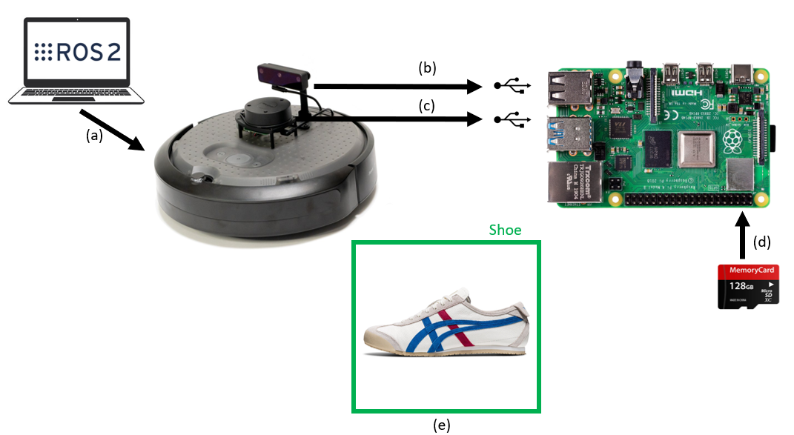
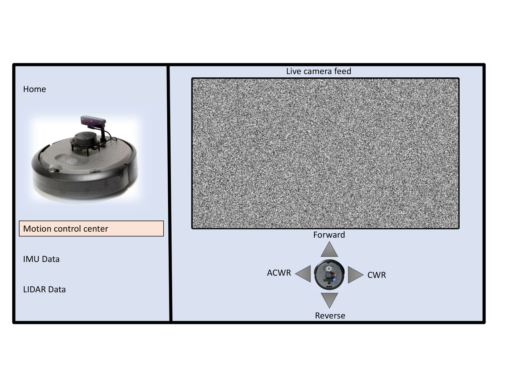
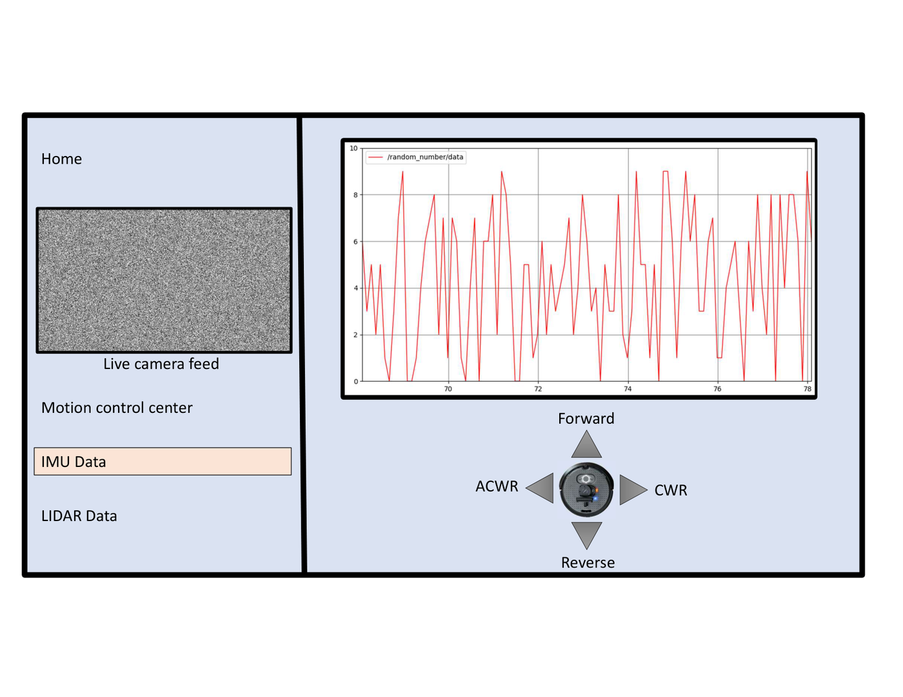

# Hardware

## Platform

- TurtleBot/TurtleBot4-style mobile robot
- OAK-D camera for RGB image capture
- LiDAR scan source for obstacle avoidance
- Raspberry Pi / robot computer running ROS 2 nodes
- External workstation for development, training, and visualization

## User interface reference

The project also included a TurtleBot interface concept with live camera feed, IMU data, LiDAR data, and motion controls.

