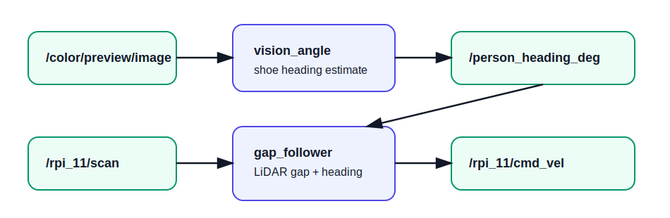

# ROS 2 Nodes

## `vision_angle`

Subscribes to camera frames and publishes a target heading angle in degrees.

- Subscribes: `/color/preview/image` (`sensor_msgs/Image`)
- Publishes: `/rpi_11/person_heading_deg` (`std_msgs/Float32`)

## `gap_follower`

Subscribes to LiDAR and heading. It smooths LiDAR ranges, masks a bubble around the closest obstacle, finds the widest navigable gap, scores candidate points by clearance and target alignment, then publishes velocity.

- Subscribes: `/rpi_11/scan` (`sensor_msgs/LaserScan`)
- Subscribes: `/rpi_11/person_heading_deg` (`std_msgs/Float32`)
- Publishes: `/rpi_11/cmd_vel` (`geometry_msgs/Twist`)

## `sim_heading`

Publishes a sinusoidal fake heading for testing the navigation node without the camera/model.

- Publishes: `/rpi_11/person_heading_deg` (`std_msgs/Float32`)
