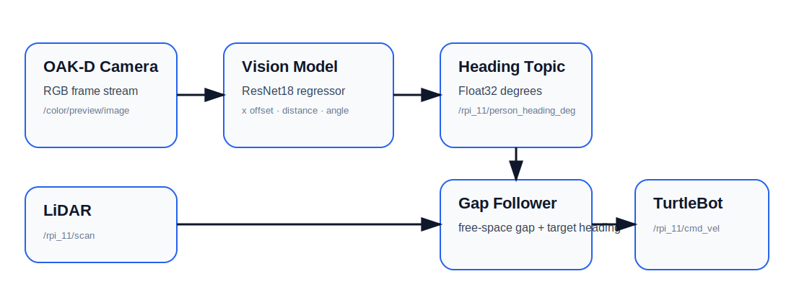

# System Overview

The assistive follower robot uses a TurtleBot-style mobile base with an OAK-D camera and LiDAR.
The high-level goal is to follow a user target while avoiding obstacles in real time.

## Pipeline

1. OAK-D camera captures RGB frames.
2. A ResNet18-style regression model estimates the shoe/user relative pose.
3. The vision node publishes a target heading angle on `/rpi_11/person_heading_deg`.
4. The LiDAR gap follower subscribes to `/rpi_11/scan` and the target heading.
5. The controller selects a navigable free-space gap aligned with the target heading.
6. Velocity commands are published to `/rpi_11/cmd_vel`.

## Design principle

The project keeps perception and navigation modular. The perception node only publishes a heading estimate. The navigation node only needs the heading and LiDAR scan, which makes the stack easier to test and debug.
