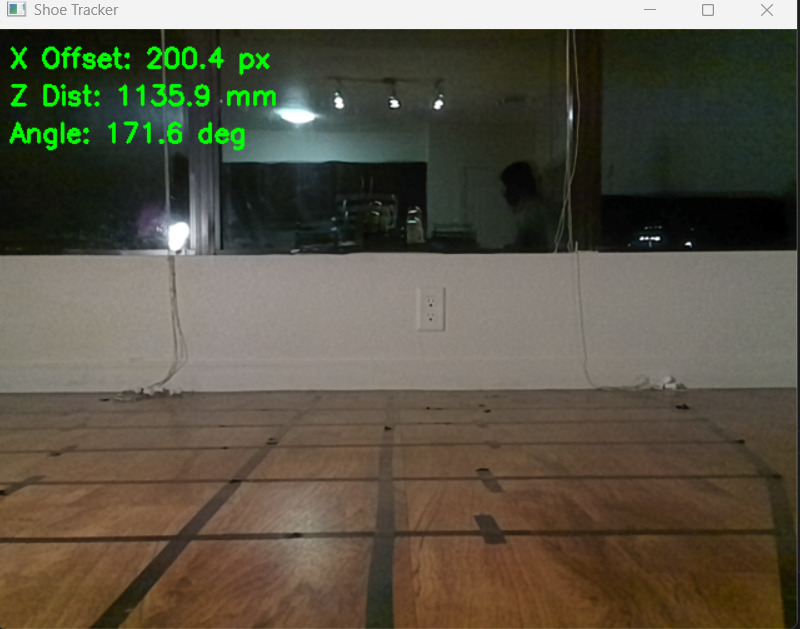

# Vision Model

The vision model is a ResNet18-style image regressor trained to estimate the target shoe pose from OAK-D camera frames.

## Outputs

```text
[x_offset_norm, z_distance_norm, sin(theta), cos(theta)]
```

Using sine and cosine for orientation avoids a discontinuity at the angle wraparound point.

## Training

```bash
python tools/train_shoe_regressor.py   --csv data/shoe_dataset.csv   --image-dir data/raw/scene2/images   --output-model models/shoe_model.pth   --epochs 100
```

For a quick smoke test using only the included sample images:

```bash
python tools/train_shoe_regressor.py   --csv data/sample_dataset.csv   --image-dir .   --output-model models/checkpoints/sample_shoe_model.pth   --epochs 2
```

## Live non-ROS OAK-D test

```bash
python tools/live_oakd_predict.py --model models/shoe_model.pth
```


